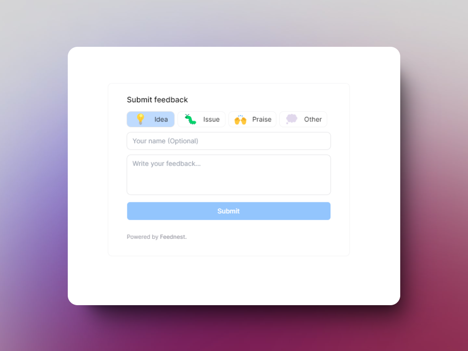

<p align="center">
  
</p>


# Feednest Widget
This widget is to be used alongside [Feednest](https://feednest.vercel.app)

## How to use
- Install widget with ```npm install feednest ```
- Import the widget like so: ```import { FeedbackWidget } from "feednest" ```
- Import the css file for styling ```import "feednest/dist/index.css"```
- Fill with right props. eg.

```tsx 
<FeedbackWidget projectId="your_project_id" />
```

- Enjoy collecting feedback!

**NB:** You can find your credentials in the project page when you create an project. Log in to [Feednest](https://feednest.vercel.app) to do this!